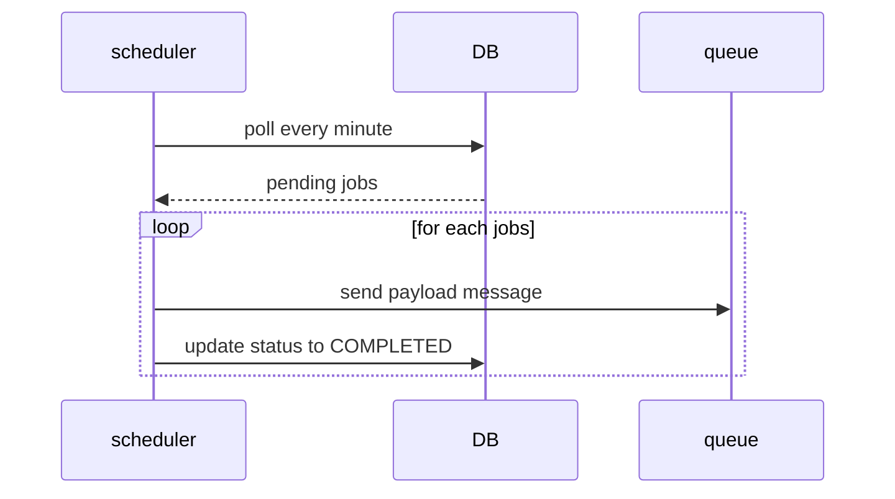

Having a distributed scheduler can be useful for orchestration purposes. For instance, it can be used to send a reminder after X minutes or enforce a workflow timeout (e.g., ensuring a payment is completed within Y minutes). However, designing a scheduler in a distributed environment is no trivial task, especially when aiming for high availability and scalability.


In this design, I will focus primarily on the challenges of achieving scalability and high availability. To keep things straightforward, I will simplify the scheduler's requirements. For example, it will not handle retries for failed jobs, nor will it deal with job-specific concepts. Instead, the scheduler will operate on an abstract level with messages or commands. These messages or commands can be executed by any worker, potentially even the same worker that requested the scheduling.


For this system let's assume the following use cases:

- user can schedule a message to be executed at given time
- user can cancel a scheduled message
- user can specify a channel (something similar to a kafka topic) where they want to receive the message

Essentially, the system will function like a delayed queue, where messages are delivered at a specified time. When a message's time is up, the system will publish it to a real queue (e.g., Kafka, RabbitMQ).

## Big picture architecture
- multiple instance
- database
- no router
- polling
- nel secondo articolo approndisco lo sharding e come evitare il polling


parliamo prima dello scheduler
The main idea is to create a scheduler service which reads pending messages at given time, submit to queue and then track it's progress, like an offset. Processed message can be also deleted by a secondary process. 


## Database

A robust database schema is a crucial element that directly impacts overall system performance. To optimize efficiency, we can start by splitting the read and write loads based on the system’s use cases.

It’s easy to see that the primary type of load on the database is “read”. The scheduler will periodically (e.g., every X minutes) query the pending scheduled messages to determine which ones need to be submitted immediately.

What about the write load? From the perspective of external actors, the system supports creating new scheduled messages or deleting existing ones. Internally, the scheduler also needs to update the status of messages once they are completed or have failed.

The key challenge is to design an efficient way to retrieve messages that are ready to be submitted. For this design, I’ll use MongoDB, a NoSQL database that enables easy scaling and partitioning of data.

### Schema design

A database schema for NoSQL like database

```json
{
	"scheduleId": "...",
	"destinationTopic": "...",
	"executionTime": "date-time",
	"payload": "scheduled command payload",
	"status": "PENDING|DELIVERED|DELIVERY_FAILED"
}
```

The schema is pretty simple with few fields:

- `payload`: Contains the data for the scheduled job. This payload will be delivered to the queue.
- `status`: Tracks the schedule status. The default status is `PENDING`, while `DELIVERED` means the message has been sent to the `destinationTopic`, and `DELIVERY_FAILED` indicates a failure to deliver the message to the queue.
- `executionTime`: A timestamp, rounded to the nearest minute or second, based on the scheduler’s granularity.
- `destinationTopic`: Specifies the topic where the scheduler will publish the message. This could be a Kafka topic or a RabbitMQ routing key.

#### Storing Offset and Execution Time
In addition to the main scheduler collection, the system will have a dedicated collection to store the offset and the last `executionTime`. This will allow the scheduler to track the progress of scheduled messages more effectively.
The structure of this collection could look like this:

```json
{
	"lastExecutionTime": "date-time"
}
```
Where:

- `lastTaskId`: A unique identifier for the task being tracked.
- `lastExecutionTime`: The last time the task was executed, helping to track the progress and avoid redundant processing.

#### Optimize query
Example of SQL-like query to retrieve messages for next execution time. e.g. current `executionTime > 2024/09/25T12:50:00Z AND executionTime < 2024/09/25T12:50:00Z`

```jsx
SELECT * FROM schedules 
WHERE executionTime > {lastExecutionTime} 
AND executionTime < "2024/09/25T12:50:01Z" 
```
Why use a range query? It makes handling issues related to timestamp precision or small variations in service processing easier, especially in failure scenarios.

Without a proper data partition strategy, this query could result in a full scan of all shards. For example, if using `scheduleId` as the shard key, running this query would span multiple partitions. To optimize the search query, a better shard key would be `executionTime`. This approach allows the query to be answered by exploring a single shard or a reduced number of shards. In MongoDB, this type of shard key is called a Range Shard Key. MongoDB automatically splits the data space into multiple ranges and redirects the request to the most appropriate shard or set of shards. From an abstract point of view, it's as if we are grouping all jobs with the same scheduling date into the same group.

The second operation is the update of message to `DELIVERED` o `DELIVERY_FAILED`. This kind of operation leverage on scheduleId, using `executionTime` as only the shard key, the write operation lead into scatter-gather. So we can create composite shard key, like the following:
```js
db.shardCollection("messages", {executionTime: 1, scheduleId: 1})
```

### Dealing with Skewed Partitions and Hotspotting
What happens if many jobs are scheduled at the same time? It depends on the granularity of the executionTime (e.g., rounding the timestamp to the second or minute), but it could lead to **skewed partitions**. Additionally, MongoDB suffers from Monotonic Increasing Keys (such as timestamps), which can lead to **shard hotspotting**. We will address how to resolve this issue in the next section when discussing the **scheduler-service**.

## Design Scheduler service

In this first scheduler design, it's behaviour is pretty simple.

1. polling every minute/second for task with status `PENDING` 
2. check if message is `PENDING`
2. send a message to queue with payload
3. update job status based on queue’s publish outcome



Obviously the polling frequency implies the scheduler granularity. For now, let's assume a second granularity even this implies a lot of query on database. In subsequent designs, I will explore how to improve the system to avoid too many useless queries (spoiler: using actor-like approach and caching). 

The system seems to be ready to be implemented, but what about horizontal scalability? If I want to run multiple instances of schedulers, we led into a concurrency issue. e.g. two different instances try to poll same jobs and send the same events. Also, there is no load distribution between instances!

## Re-Design: Make it scalable!

We have 3 main problem:

- possibile partition skew when there are a lot of scheduled job at same minute
- scheduler-service cannot properly scale horizontaly. Increasing instances doesn’t distributed the load
- scheduler-service is a single point of failure

The idea is to distribute the load at application level. If you have 10 000 jobs scheduled at the same time, we can split it into 10 000 / number of instances. In this way, each service will handle different partition and poll only for its assigned partitions.

### Database

At database schema level we must introduce a new field: `bucket`. Each bucket can contains multiple jobs scheduled at the same minute. Suppose to define a total number of buckets e.g. 20, this means that multiple job scheduled at the same time can be potentially processed by a max of **20 parallel instances.** 

The max number of buckets its an hyperparameter to be fine tuned based on load expectation, something like to the number of partition for a kafka topic.

So extend the schema in the following way:
```json
{ 
	"scheduleId": "...",
	"executionTime": "date-time",
	"bucked": 1,
	"payload": "scheduled command payload",
	"status": "PENDING|DELIVERED|DELIVERY_FAILED"
}
```

Now, `executionTime` and `bucket`  can be joined as a composite shard key! So, jobs scheduled at the same time of the same bucket will be located to the same partition. Also, this will reduce the partition skew for jobs scheduled at the same time.

### Scheduler Service

The re-design of scheduler service is not trivial, the idea is to split workload among multiple instances. For example, fixed max of buckets to 20 and 4 scheduler instances, we must split and assign partition to 4 scheduler instance. The first one will handle the first 5 buckets, the second one from the second 5 buckets and so on. What happens when a node fails? Or a new one is scaled-out? The system needs to be rebalanced! Our system is evolved into a stateful service! We need a sort of coordination and cluster aware mechanism.

::callout{type="info" icon="mdi:information"}
To implement this kind of solution there is a lot of technology we can use:

- Zookeeper
- A distributed consensus algorithm like Raft or Paxos
- Distributed map with Hazelcast
::

Now, multiple instance of scheduler can be deployed. Using cluster membership and a leader election mechanism, the leader assign partition to itself and other members. Each member has a defined working set of buckets and can poll for it’s assigned buckets.

The last pain point: how to assign a job to a bucket? 

It’s pretty simple: a round robin policy is enough. Another approach could be `hash(executionTime) % buckets`  but this led to assign same bucket for job scheduled at the same! Using a round robin policy you will distribute workload to different buckets. Also, a random policy can be enough, on high scale a random function will distribute workload evenly among buckets.

## Future works