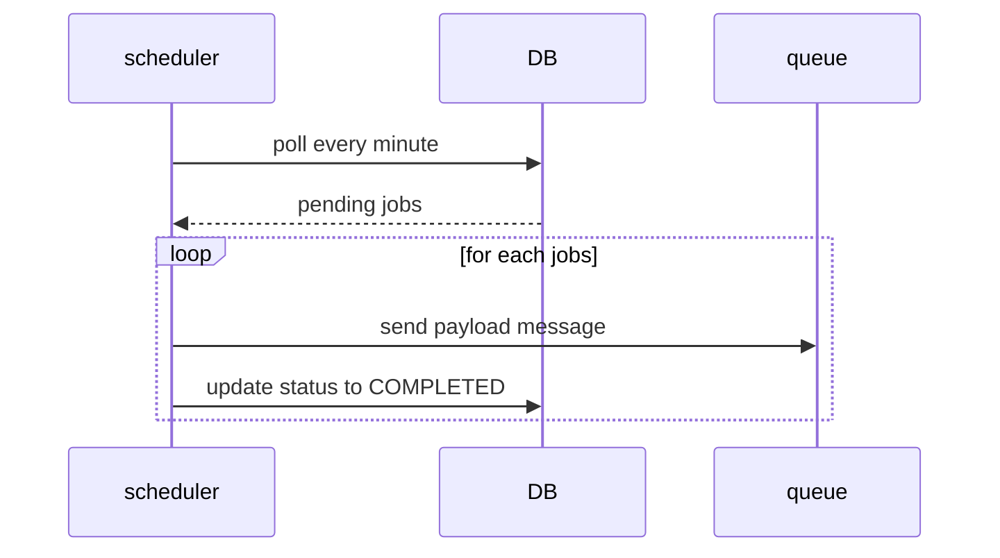

Having a distributed scheduler can be useful for orchestration purposes, for example sending a reminder after X minutes or set a workflow timeout (a payment must be completed by Y minutes). Designing a scheduler in a distributed environment is not trivial especially when trying to achieve high availability and scalability.

::callout{type="info" icon="mdi:information"}
In this design I want to focus mainly in the challenges to overcome to achieve scalability and high availability. So I will simplify the requirements of the scheduler. For example, it will not handle retries for any failed jobs, nor will it handle the concept of jobs, but it will all be traced back to a message/command that can be executed by arbitrary workers, perhaps the same ones that requested the scheduling of the command itself.
::

Use cases:

- user can schedule a message to be executed at given time
- user can cancel a scheduled message
- user can specify a channel (something similar to a kafka topic) where wants to receive the message

To keep system as simple as possibile will not handle use complex retry mechanism like requeuing at this stage. This feature will be added in future.

## Big picture architecture


## Database

A robust database schema is crucial element which directly affects the overall performance. Let’s start by splitting read and write load based on system use cases.

It’s easy to understand that database’s primary load type is “read”. The scheduler will read every X minutes the pending scheduled task to establish which must be executed right now. Also, the system must allow retrieving a scheduled job by its `scheduleId`.

What’s about write load? From external actor perspective the system allows inserting new schedule job, update/delete existing job. Internally, the scheduler system also needs to remove or update job status when it’s completed/failed.

The key point is to provide an efficient way to retrieve tasks that are currently scheduled to be executed. In this design  I’ll use MongoDB, a NoSQL database which allows us to scale-out and partition data easily. 

### Schema design

A database schema for NoSQL like database

```json
{
	"scheduleId": "...",
	"executionTime": "date-time",
	"payload": "scheduled command payload",
	"status": "PENDING|DELIVERED|DELIVERY_FAILED"
}
```

The schema is pretty simple with few fields:

- `payload`: contains the data of the scheduled job. The payload will be delivered to queue
- `status`: to track schedule status. `PENDING` is default status, while `DELIVERED` means sent to queue and `DELIVERY_FAILED` when fail to deliver message to queue
- `executionTime` is a timestamp round up to minute or second, based on scheduler granularity

Example of SQL-like query to retrieve task for next execution time. e.g. current `executionTime = 2024/09/25T12:50:00Z`

```jsx
SELECT * FROM schedules WHERE executionTime = "2024/09/25T12:50:00Z"
```

In a high scale scenario, without a proper data partition strategy this query led into a scan of all shards. If using `scheduleId` as shard key, running this query spans on multiple partitions. To optimize search query a proper shard key could be the `executionTime` . In this way the query can be answered by “exploring” a single shard. 

In a high scale scenario, without a proper data partition strategy this query led into a scan of all shards. If using `scheduleId` as shard key, running this query spans on multiple partitions. To optimize search query a proper shard key could be the `executionTime` . In this way the query can be answered by “exploring” a single shard. 

From a more abstract point of view, it is as if we are grouping all jobs with same scheduling date into the same group. 

What happens if there are a lot of job scheduled at the same time? It depends on `executionTime` granularity (e.g. round up timestamp to second or minute), but maybe led into a **skewed partition**. We will address to solve this issue later, when discussing about **scheduler-service.**

## Design Scheduler service

Lo scheduler implementa le funzionalità core per stabilire quali sono i task da eseguire secondo la programmazione richiesta dall’utente. So it’s responsible for:

1. polling every minute for task with status `PENDING` 
2. send a message to queue with payload
3. update job status based on queue’s publish outcome



Obviously polling every minute implies that the system will handle at most granularity per minute. In subsequent designs, I will explore how to implement a system that can handle finer granularity and manage database accesses more efficiently. 

The system seems to be ready to be implemented, but what about horizontal scalability? If I want to run multiple instances of schedulers, we led into a concurrency issue. e.g. two different instances try to poll same jobs and send the same events. Also, there is no load distribution between instances!

## Re-Design: Make it scalable!

We have 3 main problem:

- possibile partition skew when there are a lot of scheduled job at same minute
- scheduler-service cannot properly scale horizontaly. Increasing instances doesn’t distributed the load
- scheduler-service is a single point of failure

The idea is to distribute the load at application level. If you have 10 000 jobs scheduled at the same time, we can split it into 10 000 / number of instances. In this way, each service will handle different partition and poll only for its assigned partitions.

### Database

At database schema level we must introduce a new field: `bucket`. Each bucket can contains multiple jobs scheduled at the same minute. Suppose to define a total number of buckets e.g. 20, this means that multiple job scheduled at the same time can be potentially processed by a max of **20 parallel instances.** 

The max number of buckets its an hyperparameter to be fine tuned based on load expectation, something like to the number of partition for a kafka topic.

So extend the schema in the following way:
```json
{ 
	"scheduleId": "...",
	"executionTime": "date-time",
	"bucked": 1,
	"payload": "scheduled command payload",
	"status": "PENDING|DELIVERED|DELIVERY_FAILED"
}
```

Now, `executionTime` and `bucket`  can be joined as a composite shard key! So, jobs scheduled at the same time of the same bucket will be located to the same partition. Also, this will reduce the partition skew for jobs scheduled at the same time.

### Scheduler Service

The re-design of scheduler service is not trivial, the idea is to split workload among multiple instances. For example, fixed max of buckets to 20 and 4 scheduler instances, we must split and assign partition to 4 scheduler instance. The first one will handle the first 5 buckets, the second one from the second 5 buckets and so on. What happens when a node fails? Or a new one is scaled-out? The system needs to be rebalanced! Our system is evolved into a stateful service! We need a sort of coordination and cluster aware mechanism.

::callout{type="info" icon="mdi:information"}
To implement this kind of solution there is a lot of technology we can use:

- Zookeeper
- A distributed consensus algorithm like Raft or Paxos
- Distributed map with Hazelcast
::

Now, multiple instance of scheduler can be deployed. Using cluster membership and a leader election mechanism, the leader assign partition to itself and other members. Each member has a defined working set of buckets and can poll for it’s assigned buckets.

The last pain point: how to assign a job to a bucket? 

It’s pretty simple: a round robin policy is enough. Another approach could be `hash(executionTime) % buckets`  but this led to assign same bucket for job scheduled at the same! Using a round robin policy you will distribute workload to different buckets. Also, a random policy can be enough, on high scale a random function will distribute workload evenly among buckets.

## Future works