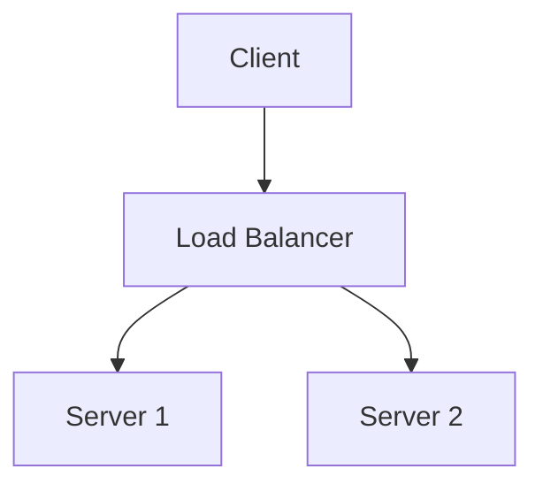

In modern microservices architectures, ensuring that database updates and events sent to other services stay in sync can be surprisingly tricky.

Imagine a common scenario: a service processes orders, updates the database to mark them as paid, and then emits an `OrderPaid` event to other services like Billing or Inventory. Everything seems straightforward, but what if something goes wrong between the database commit and sending the event?

Even in a well-tested system, this gap can lead to inconsistencies: downstream services might act on outdated or missing information, and retrying manually can be cumbersome.

In this article, we’ll explore how the Transactional Outbox Pattern can help prevent lost events and guarantee consistency. We’ll start from a simple, naive approach, then step through more robust solutions, including strategies for distributed systems with multiple replicas handling event delivery.

The goal is not to show one solution, but to help you understand the trade-offs across the entire landscape, with a focus on challenge that distributed systems introduce.

## The problem

In many microservices and domain-driven designs, modifying an entity or aggregate often triggers relevant side effects. These side effects could include:

* Sending events to other services (e.g., notifying Billing of a paid order)
* Sending emails or notifications
* Updating caches or search indexes
* Triggering workflows in external systems
* Logging or auditing actions
* Invoking third-party APIs

Even if your database transaction commits successfully, executing these side effects reliably is not trivial. Because the side effect typically occurs outside the boundary of your system, you face the same fundamental problem: how to guarantee that every important change leads to the corresponding side effect *at least once*.

Common pitfalls include:

* Crashes or network failures occurring after the database commit but before the side effect is executed
* Duplicate side effects if retries are implemented naively
* Inconsistent state if side effects are executed out of order

## A naive approach: side effect after commits

A first naive approach is to simply execute the side effect immediately after committing the database transaction. For example:

```kotlin
fun processOrder(orderId: String) {
    val order = orderRepository.findById(orderId)
    order.markAsPaid()
    orderRepository.save(order) // Database commit

    eventBus.publish(OrderPaidEvent(orderId)) // Side effect
}
```

And it's right from external point of view: if the database commit succeeds, we proceed to send the event. However, this approach has a critical flaw: if the service crashes or a network failure occurs right after the database commit but before the event is sent, the event will be lost. Downstream services will never receive the `OrderPaid` event, leading to inconsistencies.

You can try to change the order of operations, like sending the event before committing the transaction, but that introduces other issues, such as sending events for transactions that might later fail. (So basically it violates the event definition which is "something that has already happened".)

It works… until the first real failure.

## The Transactional Outbox Pattern

In order to solve this problem, we can rely on the database transactions capabilities. The idea is to store the events and the entity changes in the same database transaction. This way, if the transaction commits successfully, we are guarenteed that the event is not lost. 

```kotlin
fun processOrder(orderId: String) {
    val order = orderRepository.findById(orderId)
    order.markAsPaid()
    orderRepository.save(order) // Database commit

    // Store the event in the outbox table
    outboxRepository.save(OutboxEvent("OrderPaid", orderId))
}
```

Now, we need a way to send the events stored in the database to the event bus (or any other external system). A separate component must read the outbox table and send the events. The implementation of this component is not trivial, as it must handle retries, failures, and ensure that events are sent in the correct order.

// TODO: add mermmaid diagram of the outbox pattern

```mermaid
  graph TD
      A[Client] --> B[Load Balancer]
      B --> C[Server 1]
      B --> D[Server 2]
  ```


## Polling Processor

The simpliest way to implement the outbox relay is with a polling processor. This is a background job that periodically checks the outbox table for new events and sends them to the external system.

```kotlin
Scheduler.scheduleAtFixedRate(::outboxRelay, initialDelay=0, period=5000)

fun outboxRelay() {
    val events = outboxRepository.findUnsentEvents(pageSize=100)
    for (event in events) {
        try {
            eventBus.publish(event)
            outboxRepository.markAsSent(event.id)
        } catch (e: Exception) {
            // Log the error and retry later
        }
    }
}
```

This approach obviously has some limitations:

* Latency: events are not sent immediately, but only when the polling job runs
* Scalability: a single polling job may become a bottleneck if the event volume is high
* Ordering: ensuring that events are sent in the correct order can be challenging
* No distributed support: if you have multiple instances of the relay, they may compete to send the same events, leading to duplicates

To solve the distribued support issue we can rely on a leader election mechanism (or a simple distributed lock) to ensure that only one instance of the relay is active at any time. This way, we can avoid duplicates and ensure that events are sent in the correct order. Also we need to introduce a lease mechanism to handle failover scenarios, where the active relay instance crashes and another instance takes over. The lease allows the new instance to acquire the lock only if the previous instance has not renewed its lease within a certain timeout.

```kotlin
Scheduler.scheduleAtFixedRate(::outboxRelayWithLock, initialDelay=0, period=5000)
fun outboxRelayWithLock() {
    if (!distributedLock.tryAcquire("outbox-relay-lock")) {
        return // Another instance is already running
    }
    try {
        val events = outboxRepository.findUnsentEvents(pageSize=100)
        for (event in events) {
            try {
                eventBus.publish(event)
                outboxRepository.markAsSent(event.id)
            } catch (e: Exception) {
                // Log the error and retry later
            }
        }
    } finally {
        distributedLock.release("outbox-relay-lock")
    }
}
```

Even with this improvements, we have still some limitations:

* Latency: events are still not sent immediately, but only when the polling job runs
* Scalability: a single polling job may become a bottleneck if the event volume is high

## Change Data Capture (CDC) Processor

A more advanced approach is to use Change Data Capture (CDC) to monitor the outbox table for new events. This way, we can send events as soon as they are inserted into the outbox, reducing latency and improving scalability. Basically CDC is a sort of connector that reads the database transaction log and emits events for changes in the outbox table. So in order to use it, the database must support CDC (like PostgreSQL with logical replication or MySQL with binlog, or MongoDB with change streams).



<mermaid>
graph TD
    A\[Process Order] --> B\[Database Commit]
    B --> C\[Store Event in Outbox]
    C --> D\[CDC Connector]
    D --> E\[Event Bus]
    E --> F\[Downstream Services]
</mermaid>
The key benefits of CDC are:
 - Low latency: events are sent as soon as they are inserted into the outbox
 - Built-in ordering: CDC ensures that events are processed in the order they were inserted into the outbox

What about scalability and distributed support? Depends on implementations details, for example you can spin up a fixed multiple connector instances, each one handling a subset of the outbox events (e.g., based on event type or partitioning key). This way, you can scale horizontally and handle high event volumes without bottlenecks. But you must consider that each instance must track its own progress (e.g., using offsets or timestamps) to avoid duplicates and ensure ordering. 

::callout{type="info" icon="mdi:info"}
If you want to have multiple replicas which automatically scales up and down, you must implement a coordination mechanism to assign partitions to replicas dynamically.
::

Some of existing CDC tools and frameworks include Debezium with a lot of database connectors and the ability to push events directly to a message broker. The downstream service so can consume events from message broker without affecting the main database performance. 

This approach introduce a coupling between the database and message broker, and makes difficult to handle schema evolution.

## Event First, DB Later

This solutions is not very common, but is what DAPR implements under the hood. The idea is to publish the event first into an internal reliable queue with a unique event id and the update the event id and entity on database with same transaction. 

A consumer of the internal reliable queue reads the events and for each one of them:

* check if the event id exists on database
* if exists, it's a valid event and the consumer publish the event to final destination (e.g. external broker)
* if not exists, the event is not immediatly skipped, but a retry mechanism check for it's existence for a certain amount of time before skipping it. (This is due to database update latency).

Internal reliable queue can be implemented with a persistent queue like Kafka or RabbitMQ, event Redis Stream. Obvisoulsy I recomend to use DAPR direclty instead of reimplementing it from scratch.

This approach has some benefits:

* Low latency: events are sent immediately
* Built-in ordering: events are processed in the order they were published
* Scalability: the internal reliable queue can handle high event volumes without bottlenecks (e..g using kafka you have partitioning and consumer groups out of box).

The downside is the increased complexity of managing the internal reliable queue and ensuring its reliability and monitoring the skipped or delayed events due to database update latency.

## Distributed Outbox Relay Strategies

When deploying the outbox relay in a distributed environment with multiple instances, we need to consider how to coordinate these instances to avoid conflicts and ensure reliable event processing. Here are two common strategies:

### Single Active Instance

In a distributed deployment with multiple replicas of the service, we need to ensure that only one instance of the outbox relay is active at any time. This can be achieved using a leader election mechanism or a distributed lock, as described earlier. The active instance will be responsible for processing the outbox events, while the other instances remain idle. If the active instance crashes or becomes unresponsive, another instance can take over by acquiring the lock or winning the leader election. This approach ensures that events are processed in order and avoids duplicates, but it introduces a single point of failure and may lead to increased latency during failover scenarios. Also I suggest to simply the behaviour of outbox relay during publishing and delegates the consumption of events from consumer side by using a message broker which is able to scale horizontally.

### Multiple Active Instances with Partitioning

An alternative approach is to allow multiple instances of the outbox relay to be active simultaneously, each responsible for a subset of the outbox events, typically determinted by a partition key. Each instance can then process events from its assigned partition independently. This approach improves scalability and reduces latency, as multiple instances can process events in parallel. However, it requires careful coordination to ensure a right partition assignment avoiding multiple instances processing the same partition. This could be achived by using a distributed coordination service, like RAFT, or multiple leader election mechanisms, one for each partition. Additionally, each instance must track its own progress to avoid duplicates and ensure ordering within its partition.

A nice partition key for DDD like entity could be the aggregate root id, combined with a partitioned message broker publishing. This way, all events related to a specific aggregate will be processed by the same instance, maintaining consistency and ordering.

## Conclusion

The Transactional Outbox Pattern is a powerful technique for ensuring consistency between database updates and emitted events in distributed systems. By storing events in the same transaction as the database changes, we can guarantee that events are not lost, even in the face of failures. Implementing an outbox relay, is not a trivial task, especially in distributed environments when dealing with multiple replicas.
